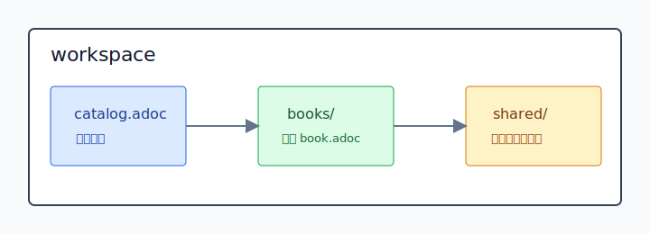

= 实时全模态视频通话体验规约书架
弥澄亮 <t103ooooo@stu.mju.edu.cn>
v0.1, 2026-06
:toc: left
:toclevels: 2
:icons: font
:experimental:
:idprefix:
:idseparator: -

本书架维护实时全模态视频通话体验的规约书稿。主书定义用户通过麦克风提供语音、通过摄像头或等价视觉输入提供当前视觉现场，并由 AI 在同一会话中以自然语音作出上下文相关回应时，一个实现必须承担的体验承诺、可观察状态、黑盒断言和符合性声明。

== 主书稿

* xref:books/08-realtime-omnimodal-call-experience-spec/book.adoc[08 实时全模态视频通话体验规约与符合性判定]：定义实时全模态视频通话体验的对象身份、构成性条件、用户旅程、公共投影、符合性断言、治理边界和符合性声明。
* xref:books/09-qwen35-omni-realtime-websocket-adapter-contract/book.adoc[09 Qwen3.5 Omni Realtime WebSocket Adapter 适配契约与验收规约]：定义 TideSync 内受控 Vision Agents Qwen WebSocket adapter 的源码身份、官方合同覆盖、状态机、事件映射、断言、测试证据、PR 符合性声明和未知项边界。

== 按角色进入

[cols="1,2,3", options="header"]
|===
|读者角色 |入口 |关注对象

|需求提出者
|xref:books/08-realtime-omnimodal-call-experience-spec/book.adoc#realtime-omnimodal-call-experience[对象身份]；xref:books/08-realtime-omnimodal-call-experience-spec/book.adoc#stakeholder-goals[目标愿望]；xref:books/08-realtime-omnimodal-call-experience-spec/book.adoc#conformance-model[符合性模型]
|要验收的体验、利益相关者目标和符合性判定方式。

|产品负责人
|xref:books/08-realtime-omnimodal-call-experience-spec/book.adoc#part-dynamic-experience[用户旅程与动态语义]；xref:books/08-realtime-omnimodal-call-experience-spec/book.adoc#part-public-projection[公共投影与可观察承诺]
|用户在进入、授权、对话、打断、受限、恢复和结束时应观察到的状态与反馈。

|架构师与开发者
|xref:books/08-realtime-omnimodal-call-experience-spec/book.adoc#session-lifecycle[会话生命周期]；xref:books/09-qwen35-omni-realtime-websocket-adapter-contract/book.adoc#state-model[Qwen adapter 状态模型]；xref:books/09-qwen35-omni-realtime-websocket-adapter-contract/book.adoc#server-event-contract[服务端事件契约]；xref:books/09-qwen35-omni-realtime-websocket-adapter-contract/book.adoc#interruption-contract[打断契约]
|实现对外承担的输入、输出、状态、打断、错误和限制语义，以及 Qwen WebSocket adapter 必须承担的机器规约。

|测试工程师与供应商评审者
|xref:books/08-realtime-omnimodal-call-experience-spec/book.adoc#part-conformance-assertions[体验符合性断言]；xref:books/09-qwen35-omni-realtime-websocket-adapter-contract/book.adoc#part-conformance-assertions[Adapter 符合性断言]；xref:books/09-qwen35-omni-realtime-websocket-adapter-contract/book.adoc#coverage-map[Adapter 覆盖映射]；xref:books/09-qwen35-omni-realtime-websocket-adapter-contract/book.adoc#appendix-conformance-checklist[Adapter 符合性检查表]
|给定前置状态、用户动作或 Qwen 服务端事件后，系统是否出现体验层和 adapter 层要求的可观察结果。

|安全、隐私与运营负责人
|xref:books/08-realtime-omnimodal-call-experience-spec/book.adoc#part-quality-governance[质量、治理与符合性声明]；xref:books/08-realtime-omnimodal-call-experience-spec/book.adoc#privacy-projection[隐私投影]；xref:books/08-realtime-omnimodal-call-experience-spec/book.adoc#tool-use-projection[工具调用投影]；xref:books/08-realtime-omnimodal-call-experience-spec/book.adoc#conformance-statement[符合性声明]
|持续采集、外部能力、成本、失败、偏离和证据材料的公共约束。

|后续维护者
|xref:books/09-qwen35-omni-realtime-websocket-adapter-contract/book.adoc#upstream-provenance[上游来源与派生治理]；xref:books/09-qwen35-omni-realtime-websocket-adapter-contract/book.adoc#runtime-import-contract[运行时加载]；xref:books/09-qwen35-omni-realtime-websocket-adapter-contract/book.adoc#live-verification-boundary[Live 验证边界]；xref:books/09-qwen35-omni-realtime-websocket-adapter-contract/book.adoc#maintenance-boundary[维护边界]
|判断本地派生源码来源、运行时加载路径、上游同步条件、未知项和未来替换边界。
|===

== 判定入口

* xref:books/08-realtime-omnimodal-call-experience-spec/book.adoc#constitutive-conditions[构成性条件]：判断一个实现是否具备实时语音输入、当前视觉现场、同一会话、自然语音回应、可打断动态语义、会话内上下文连续和公共状态投影。
* xref:books/08-realtime-omnimodal-call-experience-spec/book.adoc#neighbor-objects[相邻对象]：区分语音助手、图片问答、视频会议系统、数字人对话系统和技术演示与本书对象的边界。
* xref:books/08-realtime-omnimodal-call-experience-spec/book.adoc#visual-reference-flow[视觉指代流]：判断用户说“这个”“那里”等视觉指代时，当前视觉现场是否进入会话解释。
* xref:books/08-realtime-omnimodal-call-experience-spec/book.adoc#interruption-flow[打断流]：判断用户在 AI 回应期间的新输入是否改变当前回答的会话命运。
* xref:books/08-realtime-omnimodal-call-experience-spec/book.adoc#error-projection[错误投影]：判断权限、网络、设备、模型和工具错误是否转化为用户可理解的能力限制和恢复路径。
* xref:books/08-realtime-omnimodal-call-experience-spec/book.adoc#assertion-surface[断言表面]：把体验承诺写成黑盒断言，检查用户动作和可观察结果。
* xref:books/08-realtime-omnimodal-call-experience-spec/book.adoc#conformance-statement[符合性声明]：把实现范围、断言结果、条件限制、扩展能力、偏离项和证据材料放入同一份可审查声明。
* xref:books/09-qwen35-omni-realtime-websocket-adapter-contract/book.adoc#qwen-websocket-adapter-artifact[Qwen WebSocket Adapter 人工制品]：判断当前对象是否是 TideSync 内受控源码、运行路径、事件契约、状态机和验收证据共同成立的 adapter。
* xref:books/09-qwen35-omni-realtime-websocket-adapter-contract/book.adoc#native-support-definition[原生支持定义]：判断 Vision Agents 是否真正让 Qwen3.5 Omni Realtime WebSocket 成为一等公民，而不是只连接模型或播放音频。
* xref:books/09-qwen35-omni-realtime-websocket-adapter-contract/book.adoc#adapter-interruption-assertions[Adapter 打断断言]：判断 Qwen speech_started 是否触发用户 turn、本地 flush、远端 cancel、agent interrupted 和 stale delta 屏蔽。
* xref:books/09-qwen35-omni-realtime-websocket-adapter-contract/book.adoc#pr-conformance-statement[PR 符合性声明]：判断实现 PR 是否公开断言结果、测试命令、运行路径、上游来源、偏离项和未知项。

== 结构化书写参考

* xref:books/07-structured-writing-conventions/book.adoc[07 结构化书写约定标本]：说明稳定标题、role、rel、附加字段和交叉引用如何形成可读、可维护、可被工具链识别的书稿表面。

08 号主书在 xref:books/08-realtime-omnimodal-call-experience-spec/book.adoc#appendix-structured-surface[结构化表面约定]中记录本书使用的 role 词表、rel 关系谓词和 `normative` 字段。
09 号 adapter 书在 xref:books/09-qwen35-omni-realtime-websocket-adapter-contract/book.adoc#appendix-structured-surface[结构化表面约定]中记录 adapter 契约使用的 role 词表、rel 关系谓词和 `normative` 字段。

== 工作区地图

