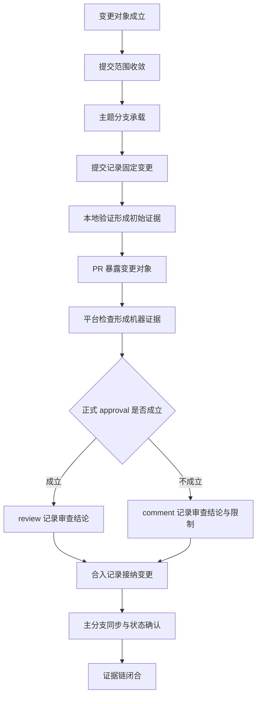

# 仓库的 PR 留痕与变更接纳工作流

## 对象边界

仓库的 PR 留痕与变更接纳工作流，是在协作者数量有限、正式独立审批可能不足的仓库中，用主题分支、范围一致的提交、PR 描述、机器检查、审查痕迹和合入记录共同构成变更接纳证据链的工作规约。

这套工作流处理的是变更如何被仓库主线接纳。PR 在这里承担证据容器的角色：它把变更对象、接纳理由、验证结果、审查判断和合入事实放在同一个平台对象里，使后续维护者能够回到同一位置理解变更为什么进入主线。

仓库仍然需要变更接纳记录。协作者数量少只影响审查证据的形态，不取消变更对象、验证结果、审查判断和合入事实本身的记录需求。

该工作流适用于需要留下接纳依据的仓库变更，包括文档归档、许可证调整、发布配置、CI 配置、功能实现、缺陷修复、版本发布和治理文件调整。

## 构成性条件

PR 留痕与变更接纳工作流成立，需要同时具备以下对象。

| 对象 | 作用 |
|---|---|
| 变更对象 | 说明本次 PR 接纳的是什么。 |
| 提交范围 | 使文件集合与变更对象保持一致。 |
| 主题分支 | 为变更对象提供独立承载面。 |
| 提交记录 | 固定变更内容，并记录对象、依据和后续用途。 |
| PR 描述 | 把变更对象、接纳理由、影响面和验证方式投影到平台。 |
| 机器检查 | 形成 CI、安全扫描、构建、测试或格式检查等可见验证证据。 |
| 审查痕迹 | 记录人的范围判断、验证判断和接纳判断。 |
| 合入记录 | 记录主分支接纳该变更的事实。 |
| 收尾状态 | 确认主分支、远端分支、本地状态和平台记录可以互相解释。 |

缺少变更对象，PR 只是文件搬运。缺少验证投影，接纳理由无法被检查。缺少审查痕迹，后续维护者只能看到合入结果，看不到接纳判断。缺少合入后状态确认，平台记录和本地仓库状态之间可能产生新的解释成本。

## 生命周期



该生命周期描述的是证据对象如何形成。命令、按钮和客户端只是可替换手段，不构成工作流本体。

## 节点规则

| 节点 | 规则 |
|---|---|
| 变更对象成立 | PR 标题和正文应能正面说明本次接纳的对象。对象可以是文档材料、发布机制、代码行为、测试覆盖、许可证文本或治理规则。 |
| 提交范围收敛 | 文件集合应共同服务同一个变更对象。提交边界由对象一致性定义。 |
| 主题分支承载 | 分支名应表达对象类别和主题，使远端分支本身也成为可读线索。 |
| 提交记录固定变更 | 提交信息应说明变更对象、依据和后续用途。提交信息与 PR 正文分工不同，但应能独立解释该提交的存在理由。 |
| 本地验证形成初始证据 | 本地检查用于证明变更没有破坏当前可检查契约。检查命令应覆盖本次变更可能影响的构建、测试、格式、类型或发布表面。 |
| PR 暴露变更对象 | PR 正文应记录摘要、范围、仓库归属理由和验证方式。 |
| 平台检查形成机器证据 | CI、安全扫描和其他平台检查应进入 PR 页面，形成可回看的机器验证记录。 |
| 审查痕迹记录判断 | 正式 approval 成立时使用 review 记录审查结论；正式 approval 不成立时使用 comment 记录审查结论和限制。 |
| 合入记录接纳变更 | 合入记录证明主线接受该变更。合入方式应服务主线历史可读性。 |
| 主分支同步与状态确认 | 合入后应确认 PR 状态、主分支提交、远端分支状态、本地主分支和工作区状态。 |

## 关键坑点

### 管理权限不等于审批证据

仓库管理权限证明账号能够执行仓库操作。审批记录证明变更经过审查。两者属于不同对象。

单人仓库或同账号 PR 可能无法产生正式 approval。此时应留下审查评论，说明正式 approval 不成立的原因、审查范围、验证结果和接纳判断。该评论承担协作者不足时的诚实审查痕迹。

### PR 的价值是证据链闭合

使用 PR 的价值，不只在于阻止未审查代码进入主线，也在于让接纳过程成为可回看的平台对象。变更对象、机器检查、审查判断和合入事实位于同一个 PR 页面时，后续维护者可以从一个入口恢复判断链。

协作者不足时，流程不应伪造独立审查。流程应准确表达当前审查形态：谁检查了什么，哪些检查通过，哪些平台语义不可用，为什么该变更可以进入主线。

### 正文表面需要先被检查

PR 正文、审查评论和 release notes 属于平台留痕表面。它们进入平台后会成为长期记录。

多行 Markdown 正文包含反引号、变量符号、引号、命令替换符或代码块时，应先落为正文文件或其他可检查文本，再交给平台命令读取。正文文件使留痕内容先成为本地可审查对象，再成为远端记录，降低插值、转义或模板替换改变文本含义的风险。

### 提交对象比排除清单重要

提交边界应由对象一致性定义。一次 PR 接纳一个对象，文件集合围绕该对象组织，验证方式围绕该对象选择，PR 正文围绕该对象说明。

排除语句只在阻止高成本误读时进入核心文本。常规情况下，正面说明变更对象比列出相邻对象更有用。

### 检查通过不等于对象成立

机器检查通过只能证明当前可检查契约没有发现失败。它不能自动证明变更属于仓库，也不能自动证明变更对象被正确定义。

PR 仍需说明对象为什么属于当前仓库、为什么由本次变更接纳、后续服务什么文档、代码、发布或治理结构。

### 合入后仍需闭合生命周期

合入记录证明主线接受变更。证据链闭合还需要确认平台检查可回看、审查痕迹可回看、主分支包含合入提交、本地状态与远端状态一致。

合入后状态不可解释，会把变更接纳的成本转移到下一次维护。

## PR 正文模板

模板仅供参考，一定要根据具体的业务情况、实际情况、实际的一些信息灵活调整，进行增加、修改或删除均可。

```markdown
## Summary

本 PR 接纳 <变更对象>。

## Scope

- <文件或材料类别>
- <文件或材料类别>

## Repository Rationale

<说明该对象为什么属于当前仓库，以及后续服务什么文档、发布、代码或治理结构。>

## Verification

- <检查项>
```

## 审查评论模板

模板仅供参考，一定要根据具体的业务情况、实际情况、实际的一些信息灵活调整，进行增加、修改或删除均可。

正式 approval 不成立时，审查评论可以使用以下结构。

```markdown
Review trail note.

Formal approval is unavailable because <平台或协作限制>.

Review conclusion:

- Scope: <变更范围判断>
- Rationale: <接纳理由>
- Verification: <检查结果>
- Merge readiness: <是否适合合入>
```

该评论记录审查判断。正式 approval 仍由平台 review 机制决定；评论的价值在于让平台页面保留人的判断、验证依据和限制说明。

## 合入后检查清单

- PR 状态为 merged。
- 主分支包含合入提交。
- 平台检查记录仍可访问。
- review 或 comment 记录仍可访问。
- 本地主分支与远端主分支一致。
- 临时分支状态可解释。
- 工作区状态可解释。

## 压缩规则

PR 留痕工作流服务变更接纳，不服务流程表演。

主题分支承载变更对象。

提交记录固定变更对象。

PR 描述解释变更对象。

机器检查验证可检查契约。

审查痕迹记录人的判断。

合入记录证明主线接纳。

状态确认关闭证据链。

## PR（Pull Request）提交规范

1. 请基于 PR 添加新功能。
2. 每个PR只做一件事：每个 PR只实现或修改单一功能；鼓励尽可能小、粒度尽可能细的 PR；大功能应拆分为多个独立 PR 分步提交。
3. PR标题与描述需清晰完整，内容包含：
    - 标题：一句话说明本 PR 新增/修改了什么。
    - 功能描述：说明该功能的作用与使用方式。
    - 实现思路：简要说明技术选型或核心实现逻辑。
    - 测试方式：如何验证该功能正常运行。
4. PR合并后，主分支代码需保持可运行状态，项目在任意时间查看应能复现演示效果。

